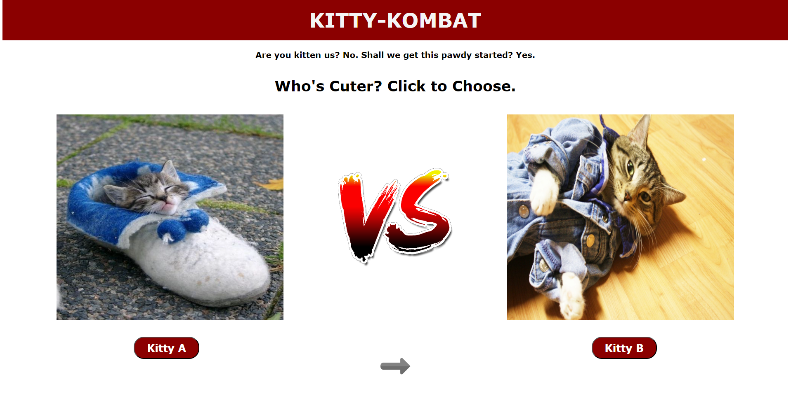

# [Kitty Kombat](https://devin-diaz.github.io/Kitty-Kombat/)
**A fun way to pick the cutest cats!**

## Project Overview

Kitty Kombat is a light-hearted, interactive application where users can vote for their favorite cat image out of a random pairing, helping crown the ultimate kitty champion. Inspired by the concept seen in _The Social Network_ (specifically the FaceMash application created by Mark Zuckerberg), Kitty Kombat aims to create a playful, wholesome experience by having users compare cats in a more ethical manner.

While FaceMash pitted college students against each other, Kitty Kombat offers a more adorable and positive way to enjoy comparisons by showing pictures of cute cats sourced through The Cat API.

## How It Works

- Two random cat images are presented side by side.
- Users vote on their preferred cat by clicking on either the "Kitty A" or "Kitty B" button.
- The chosen image gets replaced, and a new random cat replaces it.
- If both options are undesirable, a "Skip" button refreshes both images simultaneously.

## Features

- **Randomized Cat Images:** Pulls unique cat images from The Cat API.
- **Fun Voting System:** Makes each decision engaging while keeping things simple.
- **Preload on Start:** Loads initial cat images when the page first loads.

## Technologies Used

- **Frontend:** HTML, CSS, JavaScript
- **API:** [The Cat API](https://thecatapi.com/)
- **Version Control:** Git
